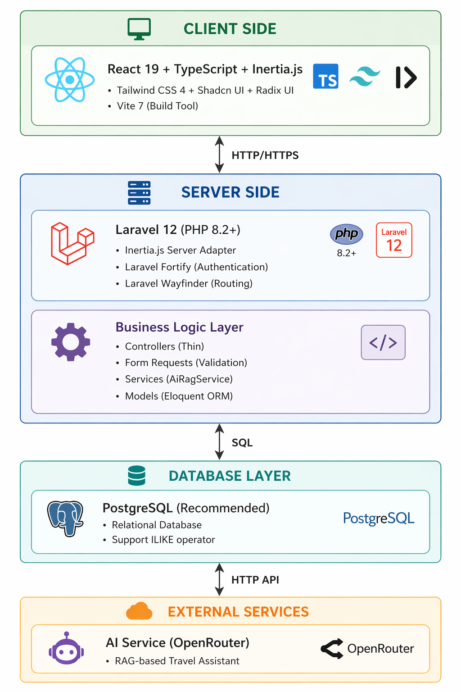
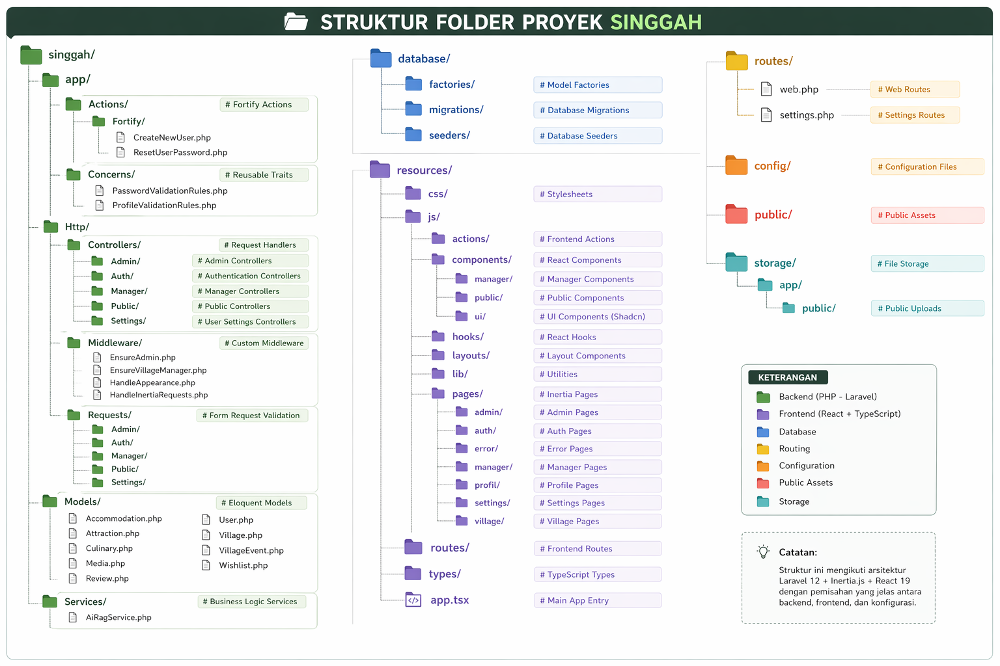
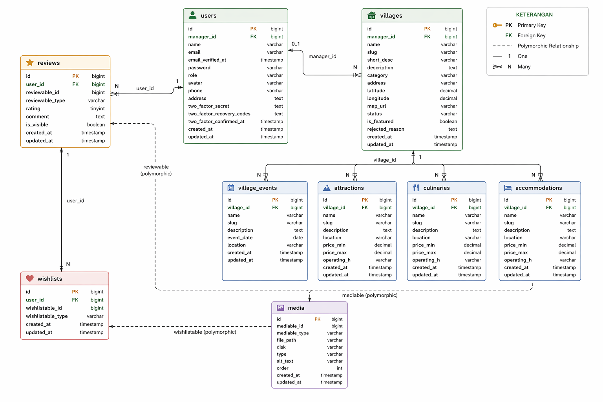
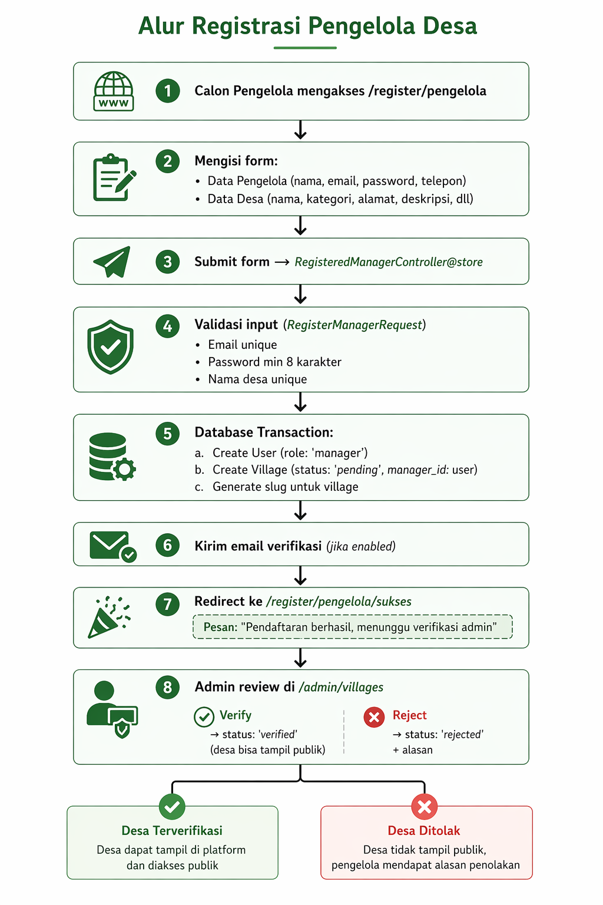
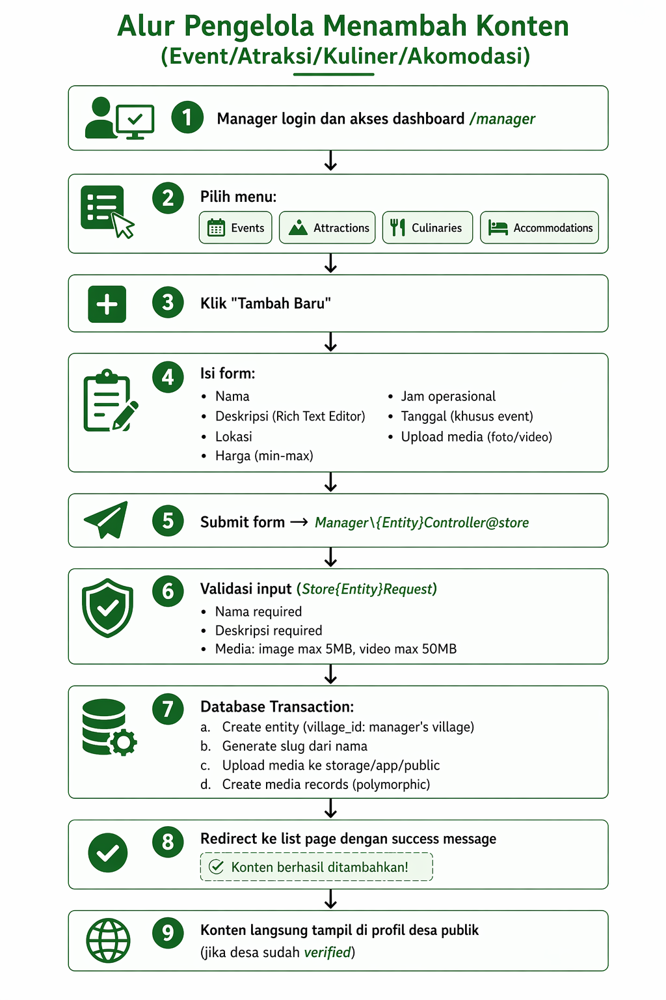
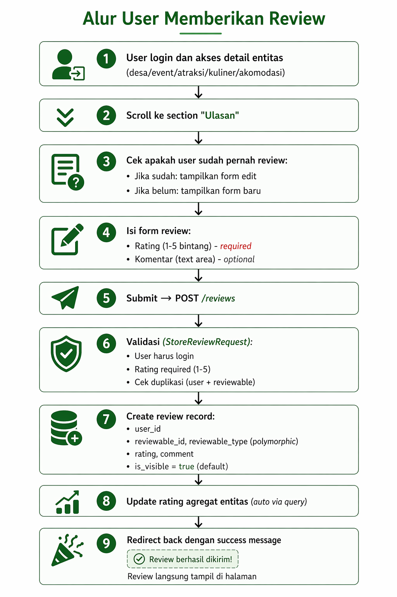
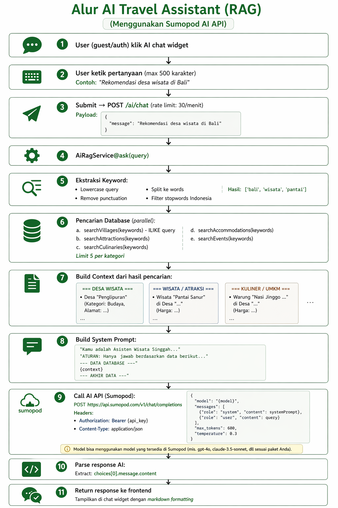
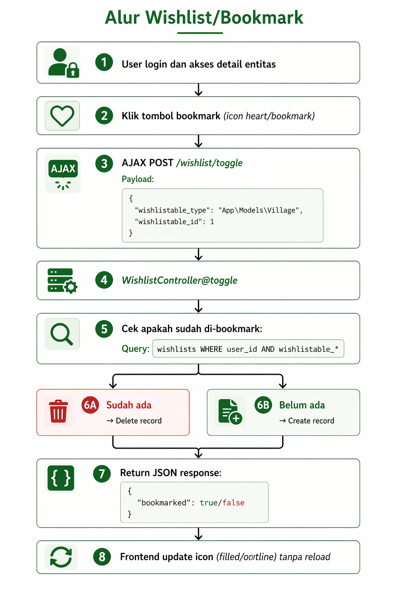

<style>
/* CSS Styling untuk Export PDF */
body {
    font-family: 'Segoe UI', Roboto, 'Helvetica Neue', Arial, sans-serif;
    line-height: 1.6;
    color: #333333;
    max-width: 800px;
    margin: 0 auto;
    padding: 20px;
}
h1, h2, h3, h4, h5, h6 {
    color: #2c3e50;
    margin-top: 1.5em;
    margin-bottom: 0.5em;
    font-weight: 600;
}
h1 {
    font-size: 2.2em;
    border-bottom: 2px solid #3498db;
    padding-bottom: 10px;
    text-align: center;
}
h2 {
    font-size: 1.8em;
    border-bottom: 1px solid #e0e0e0;
    padding-bottom: 5px;
}
p {
    margin-bottom: 1em;
    text-align: justify;
}
/* Styling Gambar agar tidak full width dan berada di tengah */
img {
    display: block;
    margin: 1.5rem auto;
    max-width: 75%;
    height: auto;
    border-radius: 8px;
    box-shadow: 0 4px 6px rgba(0,0,0,0.1);
}
/* Styling Tabel */
table {
    width: 100%;
    border-collapse: collapse;
    margin-bottom: 1.5em;
    font-size: 0.9em;
}
th, td {
    padding: 12px 15px;
    border: 1px solid #ddd;
    text-align: left;
}
th {
    background-color: #f8f9fa;
    font-weight: bold;
    color: #2c3e50;
}
tr:nth-child(even) {
    background-color: #f9f9f9;
}
/* Blok Kode dan Inline Code */
code {
    background-color: #f4f4f4;
    color: #d14;
    padding: 2px 4px;
    border-radius: 4px;
    font-family: Consolas, 'Courier New', monospace;
    font-size: 0.9em;
}
pre {
    background-color: #2b2b2b;
    color: #f8f8f2;
    padding: 15px;
    border-radius: 8px;
    overflow-x: auto;
}
pre code {
    background-color: transparent;
    color: inherit;
    padding: 0;
}
blockquote {
    border-left: 4px solid #3498db;
    margin: 1.5em 0;
    padding: 0.5em 10px;
    background-color: #f0f7fb;
    color: #555;
    font-style: italic;
}
/* Page break saat export PDF */
@media print {
    h1, h2, h3 {
        page-break-after: avoid;
    }
    img {
        page-break-inside: avoid;
        max-width: 60%; 
    }
    table, pre, blockquote {
        page-break-inside: avoid;
    }
    .page-break {
        page-break-before: always;
    }
}
</style>

# DOKUMENTASI SISTEM SINGGAH

## Platform Desa Wisata Indonesia

---

## DAFTAR ISI

1. [Ringkasan Eksekutif](#1-ringkasan-eksekutif)
2. [Arsitektur Sistem](#2-arsitektur-sistem)
3. [Struktur Database](#3-struktur-database)
4. [Fitur dan Fungsionalitas](#4-fitur-dan-fungsionalitas)
5. [Alur Sistem](#5-alur-sistem)
6. [Teknologi dan Stack](#6-teknologi-dan-stack)
7. [Keamanan dan Otorisasi](#7-keamanan-dan-otorisasi)
8. [API dan Integrasi](#8-api-dan-integrasi)
9. [Deployment dan Konfigurasi](#9-deployment-dan-konfigurasi)
10. [Panduan Pengembangan](#10-panduan-pengembangan)

---

## 1. RINGKASAN EKSEKUTIF

### 1.1 Tentang Singgah

**Singgah** adalah platform desa wisata Indonesia berbasis web yang dirancang untuk:

- Membantu wisatawan menemukan destinasi desa wisata lokal
- Memberdayakan pengelola desa untuk mengelola profil digital secara mandiri
- Menyediakan informasi terstruktur tentang wisata, kuliner, akomodasi, dan event desa

**Slogan:** "Jelajahi Keindahan Desa"

### 1.2 Latar Belakang Masalah

Indonesia memiliki ribuan desa wisata dan UMKM lokal dengan potensi besar, namun menghadapi tantangan:

- Informasi digital tersebar dan tidak terstandarisasi
- Wisatawan kesulitan menemukan informasi desa wisata dalam satu platform
- Pengelola desa belum memiliki CMS sederhana untuk mengelola konten
- UMKM lokal (kuliner, penginapan, atraksi) kurang visibilitas digital

### 1.3 Solusi yang Ditawarkan

Singgah menghadirkan platform terpusat yang menggabungkan:

1. **Direktori Desa Wisata** - Database terstruktur dan mudah dicari
2. **CMS untuk Pengelola** - Dashboard untuk mengelola konten secara mandiri
3. **Moderasi Admin** - Sistem verifikasi untuk menjaga kualitas informasi
4. **AI Travel Assistant** - Asisten berbasis RAG untuk rekomendasi wisata relevan
5. **Sistem Review & Rating** - Feedback dari pengunjung untuk meningkatkan kualitas
6. **Wishlist & Bookmark** - Fitur untuk menyimpan destinasi favorit

### 1.4 Target Pengguna

#### Pengunjung (Visitor)

- Wisatawan domestik dan mancanegara
- Pencari informasi desa wisata
- Pengguna yang ingin memberikan review dan rating

#### Pengelola Desa (Manager)

- Pengelola desa wisata resmi
- Bertanggung jawab mengelola profil desa
- Mengelola konten: atraksi, kuliner, akomodasi, event

#### Super Admin

- Administrator platform
- Melakukan verifikasi dan moderasi konten
- Manajemen pengguna dan sistem

### 1.5 Dampak yang Dituju

- **Sosial:** Meningkatkan awareness terhadap desa wisata Indonesia
- **Ekonomi:** Membuka kanal promosi digital baru untuk UMKM lokal
- **Teknologi:** Mendorong digitalisasi pariwisata berbasis komunitas

---

## 2. ARSITEKTUR SISTEM

### 2.1 Arsitektur Umum

Singgah menggunakan arsitektur **Monolithic dengan SPA (Single Page Application)** berbasis:


### 2.2 Pola Arsitektur

#### 2.2.1 MVC Pattern (Model-View-Controller)

- **Model:** Eloquent ORM untuk interaksi database
- **View:** React Components (Inertia.js)
- **Controller:** Laravel Controllers (thin, hanya handle request/response)

#### 2.2.2 Service Layer Pattern

Business logic yang kompleks dipisahkan ke service classes:

- `AiRagService`: Menangani logika AI Travel Assistant dengan RAG

#### 2.2.3 Repository Pattern (Implicit)

Eloquent Model bertindak sebagai repository dengan:

- Query Scopes (`verified()`, `featured()`)
- Relationship definitions
- Eager loading untuk optimasi query

#### 2.2.4 Polymorphic Relationships

Digunakan untuk entitas yang dapat berelasi dengan multiple models:

- **Media:** Dapat dimiliki oleh Village, VillageEvent, Attraction, Culinary, Accommodation
- **Review:** Dapat diberikan untuk Village, VillageEvent, Attraction, Culinary, Accommodation
- **Wishlist:** Dapat menyimpan Village, VillageEvent, Attraction, Culinary, Accommodation

### 2.3 Struktur Folder



---

## 3. STRUKTUR DATABASE

### 3.1 Entity Relationship Diagram (ERD)



### 3.2 Tabel Database Detail

#### 3.2.1 Tabel `users`

**Deskripsi:** Menyimpan data pengguna (admin, manager, user)

| Kolom                     | Tipe      | Deskripsi                        |
| ------------------------- | --------- | -------------------------------- |
| id                        | BIGINT    | Primary key                      |
| name                      | VARCHAR   | Nama lengkap pengguna            |
| email                     | VARCHAR   | Email (unique)                   |
| password                  | VARCHAR   | Password (hashed)                |
| role                      | ENUM      | Role: 'admin', 'manager', 'user' |
| avatar                    | VARCHAR   | Path avatar (nullable)           |
| phone                     | VARCHAR   | Nomor telepon (nullable)         |
| address                   | TEXT      | Alamat (nullable)                |
| email_verified_at         | TIMESTAMP | Waktu verifikasi email           |
| two_factor_secret         | TEXT      | Secret 2FA (encrypted)           |
| two_factor_recovery_codes | TEXT      | Recovery codes 2FA (encrypted)   |
| two_factor_confirmed_at   | TIMESTAMP | Waktu konfirmasi 2FA             |
| remember_token            | VARCHAR   | Token remember me                |
| created_at                | TIMESTAMP | Waktu dibuat                     |
| updated_at                | TIMESTAMP | Waktu diupdate                   |

**Indexes:**

- PRIMARY KEY: `id`
- UNIQUE: `email`

**Relasi:**

- `hasMany` → villages (sebagai manager)
- `hasMany` → reviews
- `hasMany` → wishlists

#### 3.2.2 Tabel `villages`

**Deskripsi:** Menyimpan data desa wisata

| Kolom             | Tipe          | Deskripsi                                 |
| ----------------- | ------------- | ----------------------------------------- |
| id                | BIGINT        | Primary key                               |
| manager_id        | BIGINT        | Foreign key ke users                      |
| name              | VARCHAR       | Nama desa                                 |
| slug              | VARCHAR       | URL slug (unique)                         |
| short_description | VARCHAR       | Deskripsi singkat (nullable)              |
| description       | TEXT          | Deskripsi lengkap                         |
| category          | VARCHAR       | Kategori desa                             |
| address           | VARCHAR       | Alamat lengkap (nullable)                 |
| latitude          | DECIMAL(10,8) | Koordinat latitude (nullable)             |
| longitude         | DECIMAL(11,8) | Koordinat longitude (nullable)            |
| map_url           | VARCHAR       | URL Google Maps (nullable)                |
| status            | ENUM          | Status: 'pending', 'verified', 'rejected' |
| is_featured       | BOOLEAN       | Apakah desa pilihan (default: false)      |
| rejected_reason   | TEXT          | Alasan penolakan (nullable)               |
| created_at        | TIMESTAMP     | Waktu dibuat                              |
| updated_at        | TIMESTAMP     | Waktu diupdate                            |

**Indexes:**

- PRIMARY KEY: `id`
- UNIQUE: `slug`
- INDEX: `status`, `is_featured`
- FOREIGN KEY: `manager_id` → users(id) ON DELETE CASCADE

**Kategori Desa:**

- `pesisir_bahari` → Pesisir & Bahari
- `agrowisata` → Agrowisata
- `kuliner_lokal` → Kuliner Lokal
- `budaya_tradisi` → Budaya & Tradisi
- `wisata_alam` → Wisata Alam

**Relasi:**

- `belongsTo` → user (manager)
- `hasMany` → village_events
- `hasMany` → attractions
- `hasMany` → culinaries
- `hasMany` → accommodations
- `morphMany` → reviews
- `morphMany` → media
- `morphMany` → wishlists

#### 3.2.3 Tabel `village_events`

**Deskripsi:** Menyimpan data event/acara desa

| Kolom       | Tipe      | Deskripsi                |
| ----------- | --------- | ------------------------ |
| id          | BIGINT    | Primary key              |
| village_id  | BIGINT    | Foreign key ke villages  |
| name        | VARCHAR   | Nama event               |
| slug        | VARCHAR   | URL slug                 |
| description | TEXT      | Deskripsi event          |
| event_date  | DATE      | Tanggal event (nullable) |
| location    | VARCHAR   | Lokasi event (nullable)  |
| created_at  | TIMESTAMP | Waktu dibuat             |
| updated_at  | TIMESTAMP | Waktu diupdate           |

**Indexes:**

- PRIMARY KEY: `id`
- INDEX: `slug`
- FOREIGN KEY: `village_id` → villages(id) ON DELETE CASCADE

**Relasi:**

- `belongsTo` → village
- `morphMany` → reviews
- `morphMany` → media
- `morphMany` → wishlists

#### 3.2.4 Tabel `attractions`

**Deskripsi:** Menyimpan data atraksi/wisata desa

| Kolom           | Tipe          | Deskripsi                  |
| --------------- | ------------- | -------------------------- |
| id              | BIGINT        | Primary key                |
| village_id      | BIGINT        | Foreign key ke villages    |
| name            | VARCHAR       | Nama atraksi               |
| slug            | VARCHAR       | URL slug                   |
| description     | TEXT          | Deskripsi atraksi          |
| location        | VARCHAR       | Lokasi (nullable)          |
| price_min       | DECIMAL(15,2) | Harga minimum (nullable)   |
| price_max       | DECIMAL(15,2) | Harga maksimum (nullable)  |
| operating_hours | VARCHAR       | Jam operasional (nullable) |
| created_at      | TIMESTAMP     | Waktu dibuat               |
| updated_at      | TIMESTAMP     | Waktu diupdate             |

**Indexes:**

- PRIMARY KEY: `id`
- INDEX: `slug`
- FOREIGN KEY: `village_id` → villages(id) ON DELETE CASCADE

**Relasi:**

- `belongsTo` → village
- `morphMany` → reviews
- `morphMany` → media
- `morphMany` → wishlists

#### 3.2.5 Tabel `culinaries`

**Deskripsi:** Menyimpan data kuliner/UMKM desa

| Kolom           | Tipe          | Deskripsi                  |
| --------------- | ------------- | -------------------------- |
| id              | BIGINT        | Primary key                |
| village_id      | BIGINT        | Foreign key ke villages    |
| name            | VARCHAR       | Nama kuliner               |
| slug            | VARCHAR       | URL slug                   |
| description     | TEXT          | Deskripsi kuliner          |
| location        | VARCHAR       | Lokasi (nullable)          |
| price_min       | DECIMAL(15,2) | Harga minimum (nullable)   |
| price_max       | DECIMAL(15,2) | Harga maksimum (nullable)  |
| operating_hours | VARCHAR       | Jam operasional (nullable) |
| created_at      | TIMESTAMP     | Waktu dibuat               |
| updated_at      | TIMESTAMP     | Waktu diupdate             |

**Indexes:**

- PRIMARY KEY: `id`
- INDEX: `slug`
- FOREIGN KEY: `village_id` → villages(id) ON DELETE CASCADE

**Relasi:**

- `belongsTo` → village
- `morphMany` → reviews
- `morphMany` → media
- `morphMany` → wishlists

#### 3.2.6 Tabel `accommodations`

**Deskripsi:** Menyimpan data akomodasi/penginapan desa

| Kolom           | Tipe          | Deskripsi                           |
| --------------- | ------------- | ----------------------------------- |
| id              | BIGINT        | Primary key                         |
| village_id      | BIGINT        | Foreign key ke villages             |
| name            | VARCHAR       | Nama akomodasi                      |
| slug            | VARCHAR       | URL slug                            |
| description     | TEXT          | Deskripsi akomodasi                 |
| location        | VARCHAR       | Lokasi (nullable)                   |
| price_min       | DECIMAL(15,2) | Harga per malam minimum (nullable)  |
| price_max       | DECIMAL(15,2) | Harga per malam maksimum (nullable) |
| operating_hours | VARCHAR       | Jam operasional (nullable)          |
| created_at      | TIMESTAMP     | Waktu dibuat                        |
| updated_at      | TIMESTAMP     | Waktu diupdate                      |

**Indexes:**

- PRIMARY KEY: `id`
- INDEX: `slug`
- FOREIGN KEY: `village_id` → villages(id) ON DELETE CASCADE

**Relasi:**

- `belongsTo` → village
- `morphMany` → reviews
- `morphMany` → media
- `morphMany` → wishlists

#### 3.2.7 Tabel `reviews` (Polymorphic)

**Deskripsi:** Menyimpan review/ulasan untuk berbagai entitas

| Kolom           | Tipe      | Deskripsi                                 |
| --------------- | --------- | ----------------------------------------- |
| id              | BIGINT    | Primary key                               |
| user_id         | BIGINT    | Foreign key ke users                      |
| reviewable_id   | BIGINT    | ID entitas yang direview                  |
| reviewable_type | VARCHAR   | Tipe entitas (Village, VillageEvent, dll) |
| rating          | TINYINT   | Rating 1-5                                |
| comment         | TEXT      | Komentar (nullable)                       |
| is_visible      | BOOLEAN   | Apakah visible (default: true)            |
| created_at      | TIMESTAMP | Waktu dibuat                              |
| updated_at      | TIMESTAMP | Waktu diupdate                            |

**Indexes:**

- PRIMARY KEY: `id`
- INDEX: `user_id`
- INDEX: `reviewable_id`, `reviewable_type` (composite)
- FOREIGN KEY: `user_id` → users(id) ON DELETE CASCADE

**Reviewable Types:**

- `App\Models\Village`
- `App\Models\VillageEvent`
- `App\Models\Attraction`
- `App\Models\Culinary`
- `App\Models\Accommodation`

**Relasi:**

- `belongsTo` → user
- `morphTo` → reviewable

#### 3.2.8 Tabel `media` (Polymorphic)

**Deskripsi:** Menyimpan media (gambar/video) untuk berbagai entitas

| Kolom         | Tipe      | Deskripsi                               |
| ------------- | --------- | --------------------------------------- |
| id            | BIGINT    | Primary key                             |
| mediable_id   | BIGINT    | ID entitas pemilik media                |
| mediable_type | VARCHAR   | Tipe entitas pemilik                    |
| file_path     | VARCHAR   | Path file di storage                    |
| disk          | VARCHAR   | Disk storage (default: 'public')        |
| type          | ENUM      | Tipe: 'image', 'video'                  |
| alt_text      | VARCHAR   | Alt text untuk accessibility (nullable) |
| order         | INTEGER   | Urutan tampilan (default: 0)            |
| created_at    | TIMESTAMP | Waktu dibuat                            |
| updated_at    | TIMESTAMP | Waktu diupdate                          |

**Indexes:**

- PRIMARY KEY: `id`
- INDEX: `mediable_id`, `mediable_type` (composite)

**Mediable Types:**

- `App\Models\Village`
- `App\Models\VillageEvent`
- `App\Models\Attraction`
- `App\Models\Culinary`
- `App\Models\Accommodation`

**Relasi:**

- `morphTo` → mediable

#### 3.2.9 Tabel `wishlists` (Polymorphic)

**Deskripsi:** Menyimpan wishlist/bookmark pengguna

| Kolom             | Tipe      | Deskripsi                   |
| ----------------- | --------- | --------------------------- |
| id                | BIGINT    | Primary key                 |
| user_id           | BIGINT    | Foreign key ke users        |
| wishlistable_id   | BIGINT    | ID entitas yang di-bookmark |
| wishlistable_type | VARCHAR   | Tipe entitas                |
| created_at        | TIMESTAMP | Waktu dibuat                |
| updated_at        | TIMESTAMP | Waktu diupdate              |

**Indexes:**

- PRIMARY KEY: `id`
- UNIQUE: `user_id`, `wishlistable_id`, `wishlistable_type` (composite)
- FOREIGN KEY: `user_id` → users(id) ON DELETE CASCADE

**Wishlistable Types:**

- `App\Models\Village`
- `App\Models\VillageEvent`
- `App\Models\Attraction`
- `App\Models\Culinary`
- `App\Models\Accommodation`

**Relasi:**

- `belongsTo` → user
- `morphTo` → wishlistable

---

## 4. FITUR DAN FUNGSIONALITAS

### 4.1 Fitur Publik (Tanpa Login)

#### 4.1.1 Halaman Beranda (`/`)

**Komponen:**

- Hero section dengan tagline dan CTA
- Statistik platform (jumlah desa, provinsi, pengunjung)
- Desa Pilihan (featured villages) - maksimal 8 desa
- Kategori desa dengan jumlah desa per kategori
- Wilayah/Provinsi populer - top 8 provinsi
- Desa Terbaru - 8 desa terbaru yang verified

**Controller:** `HomeController@index`

**Query Optimization:**

- Eager loading media (limit 1 gambar pertama)
- `withCount('reviews')` untuk jumlah review
- `withAvg('reviews', 'rating')` untuk rata-rata rating
- Scope `verified()` dan `featured()`

#### 4.1.2 Halaman Explore (`/explore`)

**Fitur Pencarian & Filter:**

- Search by nama desa, deskripsi, alamat (case-insensitive)
- Filter by wilayah/provinsi
- Filter by kategori desa
- Filter by rating minimum
- Sort by: terbaru, rating, nama, terdekat (dengan geolocation)

**Fitur Terdekat:**

- Menggunakan formula Haversine untuk menghitung jarak
- Radius maksimal 5 km dari lokasi user
- Menampilkan jarak dalam km

**Pagination:** 12 desa per halaman

**Controller:** `ExploreController@index`

#### 4.1.3 Profil Desa (`/desa/{slug}`)

**Tab/Section:**

1. **Beranda** - Informasi umum desa
2. **Event** - Daftar event/acara (paginated 6 per halaman)
3. **Wisata** - Daftar atraksi wisata (paginated 6 per halaman)
4. **Kuliner** - Daftar kuliner/UMKM (paginated 6 per halaman)
5. **Akomodasi** - Daftar penginapan (paginated 6 per halaman)
6. **Ulasan** - Review dari pengunjung (limit 30 terbaru)

**Informasi Ditampilkan:**

- Nama desa, kategori, alamat
- Deskripsi lengkap
- Galeri media (foto/video)
- Kontak pengelola (nama, telepon)
- Map location (jika ada)
- Rating agregat dan breakdown per bintang
- Review dari pengunjung

**Controller:** `VillageProfileController@show`

#### 4.1.4 Detail Konten

**Routes:**

- `/desa/{slug}/events/{itemSlug}` - Detail event
- `/desa/{slug}/attractions/{itemSlug}` - Detail atraksi
- `/desa/{slug}/culinaries/{itemSlug}` - Detail kuliner
- `/desa/{slug}/accommodations/{itemSlug}` - Detail akomodasi

**Informasi Ditampilkan:**

- Nama, deskripsi lengkap
- Galeri media
- Lokasi, jam operasional
- Harga (min-max)
- Rating dan review (paginated 5 per halaman)
- Tombol bookmark (jika login)
- Form review (jika login)

**Controllers:**

- `VillageProfileController@showEvent`
- `VillageProfileController@showAttraction`
- `VillageProfileController@showCulinary`
- `VillageProfileController@showAccommodation`

#### 4.1.5 Halaman Statis

- `/tentang` - Tentang Singgah
- `/privasi` - Kebijakan Privasi
- `/syarat` - Syarat dan Ketentuan

**Controller:** `StaticPageController`

#### 4.1.6 AI Travel Assistant

**Fitur:**

- Chat widget di semua halaman
- Rekomendasi wisata berbasis RAG (Retrieval-Augmented Generation)
- Rate limit: 30 request per menit
- Maksimal 500 karakter per pesan

**Endpoint:** `POST /ai/chat`

**Controller:** `AiChatController@chat`

**Service:** `AiRagService`

**Cara Kerja:**

1. Ekstraksi keyword dari query user (hapus stopwords Indonesia)
2. Pencarian data relevan dari database (villages, attractions, culinaries, accommodations, events)
3. Build context dari hasil pencarian
4. Kirim context + query ke AI API (SumoPod)
5. Return response AI ke user

### 4.2 Fitur Autentikasi

#### 4.2.1 Register User Biasa (`/register`)

**Form Fields:**

- Nama lengkap
- Email
- Password (min 8 karakter)
- Password confirmation

**Proses:**

1. Validasi input
2. Create user dengan role 'user'
3. Email verification (opsional, tergantung config)
4. Redirect ke home

**Provider:** Laravel Fortify

#### 4.2.2 Register Pengelola Desa (`/register/pengelola`)

**Form Fields:**

- Data Pengelola: nama, email, password, telepon
- Data Desa: nama, kategori, alamat, deskripsi
- Koordinat (latitude, longitude) - opsional
- Map URL - opsional

**Proses:**

1. Validasi input
2. Create user dengan role 'manager'
3. Create village dengan status 'pending'
4. Email verification
5. Redirect ke halaman sukses
6. Admin akan review dan verify/reject

**Controller:** `RegisteredManagerController`

**Request:** `RegisterManagerRequest`

#### 4.2.3 Login (`/login`)

**Form Fields:**

- Email
- Password
- Remember me (checkbox)

**Fitur:**

- Rate limiting (5 attempts per menit)
- Two-factor authentication (jika enabled)
- Email verification check

**Provider:** Laravel Fortify

#### 4.2.4 Forgot Password (`/forgot-password`)

**Proses:**

1. User input email
2. System kirim reset link via email
3. User klik link dan input password baru
4. Password updated

**Provider:** Laravel Fortify

#### 4.2.5 Two-Factor Authentication

**Fitur:**

- Setup 2FA via QR code
- Backup recovery codes
- Confirm password sebelum enable/disable
- Challenge page saat login dengan 2FA

**Routes:**

- `/user/two-factor-authentication` - Enable/disable
- `/user/confirmed-two-factor-authentication` - Confirm
- `/user/two-factor-recovery-codes` - Get recovery codes
- `/two-factor-challenge` - Challenge page

**Provider:** Laravel Fortify

### 4.3 Fitur User (Login Required)

#### 4.3.1 Profil User (`/profil`)

**Informasi:**

- Avatar (generated via Dicebear jika tidak ada)
- Nama, email, telepon, alamat
- Edit profil

**Form Edit:**

- Nama
- Telepon
- Alamat
- Avatar upload

**Controller:** `UserProfileController@show`, `@update`

#### 4.3.2 Keamanan (`/profil/keamanan`)

**Fitur:**

- Ubah password
- Two-factor authentication setup
- Email verification status

**Controller:** `UserProfileController@keamanan`

#### 4.3.3 Ulasan Saya (`/profil/ulasan`)

**Fitur:**

- Daftar semua review yang pernah dibuat
- Edit review
- Delete review
- Link ke entitas yang direview

**Controller:** `UserProfileController@ulasan`

#### 4.3.4 Wishlist (`/profil/wishlist`)

**Fitur:**

- Daftar semua bookmark (villages, events, attractions, culinaries, accommodations)
- Remove dari wishlist
- Link ke detail entitas

**Controller:** `WishlistController@index`

#### 4.3.5 Review & Rating

**Fitur:**

- Beri rating 1-5 bintang
- Tulis komentar
- Edit review sendiri
- Delete review sendiri
- Satu user hanya bisa review satu kali per entitas

**Endpoints:**

- `POST /reviews` - Create review
- `PUT /reviews/{review}` - Update review
- `DELETE /reviews/{review}` - Delete review

**Controller:** `PublicReviewController`

**Request:** `StoreReviewRequest`

**Validasi:**

- User harus login
- Rating required (1-5)
- Comment optional
- Tidak boleh review entitas yang sama 2x

#### 4.3.6 Wishlist/Bookmark

**Fitur:**

- Toggle bookmark (add/remove)
- AJAX request (tidak reload halaman)
- Icon berubah saat di-bookmark

**Endpoint:** `POST /wishlist/toggle`

**Controller:** `WishlistController@toggle`

**Payload:**

```json
{
    "wishlistable_type": "App\\Models\\Village",
    "wishlistable_id": 1
}
```

### 4.4 Fitur Manager (Pengelola Desa)

**Middleware:** `EnsureVillageManager`

**Akses:** User dengan role 'manager' dan memiliki village

#### 4.4.1 Dashboard Manager (`/manager`)

**Statistik:**

- Total event, atraksi, kuliner, akomodasi
- Total review
- Rata-rata rating
- Status verifikasi desa

**Controller:** `Manager\DashboardController@index`

#### 4.4.2 Kelola Profil Desa (`/manager/village/edit`)

**Form Fields:**

- Nama desa
- Kategori
- Deskripsi singkat
- Deskripsi lengkap (Rich Text Editor)
- Alamat
- Koordinat (latitude, longitude)
- Map URL

**Controller:** `Manager\VillageController@edit`, `@update`

**Request:** `Manager\UpdateVillageRequest`

#### 4.4.3 Kelola Media Desa

**Fitur:**

- Upload foto/video desa
- Reorder media (drag & drop)
- Delete media
- Set alt text untuk accessibility

**Endpoints:**

- `POST /manager/village/media` - Upload
- `DELETE /manager/village/media/{media}` - Delete

**Controller:** `Manager\VillageMediaController`

**Validasi:**

- Image: jpg, jpeg, png, webp (max 5MB)
- Video: mp4, mov, avi (max 50MB)

#### 4.4.4 Kelola Event (`/manager/events`)

**CRUD Operations:**

- Create event baru
- Read/list semua event
- Update event
- Delete event

**Form Fields:**

- Nama event
- Slug (auto-generated)
- Deskripsi (Rich Text Editor)
- Tanggal event
- Lokasi
- Media (foto/video)

**Controller:** `Manager\EventController`

**Request:** `Manager\StoreEventRequest`, `Manager\UpdateEventRequest`

#### 4.4.5 Kelola Atraksi (`/manager/attractions`)

**CRUD Operations:**

- Create atraksi baru
- Read/list semua atraksi
- Update atraksi
- Delete atraksi

**Form Fields:**

- Nama atraksi
- Slug (auto-generated)
- Deskripsi (Rich Text Editor)
- Lokasi
- Harga minimum
- Harga maksimum
- Jam operasional
- Media (foto/video)

**Controller:** `Manager\AttractionController`

**Request:** `Manager\StoreAttractionRequest`, `Manager\UpdateAttractionRequest`

#### 4.4.6 Kelola Kuliner (`/manager/culinaries`)

**CRUD Operations:**

- Create kuliner baru
- Read/list semua kuliner
- Update kuliner
- Delete kuliner

**Form Fields:**

- Nama kuliner
- Slug (auto-generated)
- Deskripsi (Rich Text Editor)
- Lokasi
- Harga minimum
- Harga maksimum
- Jam operasional
- Media (foto/video)

**Controller:** `Manager\CulinaryController`

**Request:** `Manager\StoreCulinaryRequest`, `Manager\UpdateCulinaryRequest`

#### 4.4.7 Kelola Akomodasi (`/manager/accommodations`)

**CRUD Operations:**

- Create akomodasi baru
- Read/list semua akomodasi
- Update akomodasi
- Delete akomodasi

**Form Fields:**

- Nama akomodasi
- Slug (auto-generated)
- Deskripsi (Rich Text Editor)
- Lokasi
- Harga per malam minimum
- Harga per malam maksimum
- Jam operasional
- Media (foto/video)

**Controller:** `Manager\AccommodationController`

**Request:** `Manager\StoreAccommodationRequest`, `Manager\UpdateAccommodationRequest`

#### 4.4.8 Lihat Review (`/manager/reviews`)

**Fitur:**

- Daftar semua review untuk desa dan kontennya
- Filter by entitas (village, event, attraction, culinary, accommodation)
- Tidak bisa delete review (hanya admin yang bisa)

**Controller:** `Manager\ReviewController@index`

### 4.5 Fitur Admin

**Middleware:** `EnsureAdmin`

**Akses:** User dengan role 'admin'

#### 4.5.1 Dashboard Admin (`/admin`)

**Statistik:**

- Total users (by role)
- Total villages (by status)
- Total konten (events, attractions, culinaries, accommodations)
- Total reviews
- Pending villages (butuh verifikasi)

**Controller:** `Admin\DashboardController@index`

#### 4.5.2 Manajemen User (`/admin/users`)

**Fitur:**

- List semua user dengan pagination
- Filter by role
- Search by nama/email
- Edit user (nama, email, role, phone, address)
- Update password user
- Delete user (cascade delete semua data terkait)

**Controller:** `Admin\UserController`

**Request:** `Admin\UpdateUserRequest`

#### 4.5.3 Manajemen Desa (`/admin/villages`)

**Fitur:**

- List semua desa dengan pagination
- Filter by status (pending, verified, rejected)
- Search by nama/alamat
- Edit desa (semua field)
- Verify desa (ubah status ke 'verified')
- Reject desa (ubah status ke 'rejected' + alasan)
- Toggle featured (desa pilihan)
- Delete desa (cascade delete semua konten)
- Upload media desa

**Controller:** `Admin\VillageController`

**Request:** `Admin\UpdateVillageRequest`, `Admin\RejectVillageRequest`

**Endpoints:**

- `PATCH /admin/villages/{village}/verify` - Verify
- `PATCH /admin/villages/{village}/reject` - Reject
- `PATCH /admin/villages/{village}/toggle-featured` - Toggle featured

#### 4.5.4 Manajemen Event (`/admin/events`)

**Fitur:**

- List semua event dari semua desa
- Search by nama
- Edit event
- Delete event
- Upload media event

**Controller:** `Admin\EventController`

**Request:** `Admin\UpdateEventRequest`

#### 4.5.5 Manajemen Atraksi (`/admin/attractions`)

**Fitur:**

- List semua atraksi dari semua desa
- Search by nama
- Edit atraksi
- Delete atraksi
- Upload media atraksi

**Controller:** `Admin\AttractionController`

**Request:** `Admin\UpdateAttractionRequest`

#### 4.5.6 Manajemen Kuliner (`/admin/culinaries`)

**Fitur:**

- List semua kuliner dari semua desa
- Search by nama
- Edit kuliner
- Delete kuliner
- Upload media kuliner

**Controller:** `Admin\CulinaryController`

**Request:** `Admin\UpdateCulinaryRequest`

#### 4.5.7 Manajemen Akomodasi (`/admin/accommodations`)

**Fitur:**

- List semua akomodasi dari semua desa
- Search by nama
- Edit akomodasi
- Delete akomodasi
- Upload media akomodasi

**Controller:** `Admin\AccommodationController`

**Request:** `Admin\UpdateAccommodationRequest`

#### 4.5.8 Manajemen Review (`/admin/reviews`)

**Fitur:**

- List semua review dari semua entitas
- Filter by entitas type
- Search by user/comment
- Toggle visibility (hide/show review)
- Delete review

**Controller:** `Admin\ReviewController`

#### 4.5.9 Manajemen Media (`/admin/media/{media}`)

**Fitur:**

- Delete media dari entitas manapun

**Controller:** `Admin\MediaController@destroy`

---

## 5. ALUR SISTEM

### 5.1 Alur Registrasi Pengelola Desa



### 5.2 Alur Verifikasi Desa oleh Admin


### 5.3 Alur Pengelola Menambah Konten (Event/Atraksi/Kuliner/Akomodasi)



### 5.4 Alur User Memberikan Review



### 5.5 Alur AI Travel Assistant (RAG)



### 5.6 Alur Wishlist/Bookmark



---

## 6. TEKNOLOGI DAN STACK

### 6.1 Backend Stack

#### 6.1.1 Laravel 12 (PHP 8.2+)

Framework utama untuk backend dengan fitur Eloquent ORM, Routing, Middleware, Queue, File Storage, Validation, dan Event system.

Packages: laravel/fortify, laravel/wayfinder, laravel/tinker, laravel/pail, laravel/sail

#### 6.1.2 Inertia.js Server Adapter

Bridge antara Laravel dan React dengan server-side routing, shared data via props, CSRF protection, dan partial reloads.

#### 6.1.3 PostgreSQL Database

Database relational dengan support ILIKE operator, JSON/JSONB, full-text search, geospatial queries, dan ACID compliance.

### 6.2 Frontend Stack

#### 6.2.1 React 19

Library UI dengan React Compiler, Server Components, Concurrent rendering, dan Hooks API.

#### 6.2.2 TypeScript

Type safety dengan static type checking, IntelliSense, dan interface definitions.

#### 6.2.3 Tailwind CSS 4

Utility-first CSS dengan JIT compiler, custom design system, responsive utilities, dan dark mode support.

#### 6.2.4 UI Libraries

Shadcn UI + Radix UI untuk accessible components, Dialog, Dropdown, Select, Calendar, Navigation, dan lainnya.

Additional: lucide-react, react-markdown, @tiptap/react, recharts, date-fns, sonner, next-themes

### 6.3 Build Tools

#### 6.3.1 Vite 7

Modern build tool dengan fast HMR, optimized builds, dan TypeScript support.

#### 6.3.2 Development Tools

ESLint, Prettier, TypeScript Compiler, Laravel Pint, Pest

## 7. KEAMANAN DAN OTORISASI

### 7.1 Authentication (Laravel Fortify)

- Registration, Login (rate limiting 5/min), Password reset
- Email verification, Two-factor authentication (TOTP)

### 7.2 Authorization (RBAC)

3 Role: admin (full access), manager (desa sendiri), user (publik + profil)

Middleware: EnsureAdmin, EnsureVillageManager

### 7.3 Security Measures

- Input validation via Form Requests
- File upload validation (image max 5MB, video max 50MB)
- CSRF protection (otomatis)
- XSS protection (auto escape)
- SQL injection protection (prepared statements)
- Rate limiting (login 5/min, AI chat 30/min)
- Password hashing (Bcrypt, 12 rounds)

## 8. DEPLOYMENT

### 8.1 System Requirements

- PHP 8.2+, Composer 2.x, Node.js 20+
- PostgreSQL 14+ atau MySQL 8+
- Nginx atau Apache, SSL certificate

### 8.2 Installation Steps

1. Clone repository
2. composer install --optimize-autoloader --no-dev
3. npm install && npm run build
4. Setup .env (production config)
5. php artisan key:generate
6. php artisan migrate --force
7. php artisan storage:link
8. php artisan config:cache && route:cache && view:cache

### 8.3 Nginx Configuration

Server block dengan SSL, PHP-FPM, dan security headers.

### 8.4 Queue Worker (Supervisor)

Setup supervisor untuk queue:work dengan 2 processes, auto-restart.

### 8.5 Cron Jobs

Laravel scheduler: \* \* \* \* \* php artisan schedule:run

### 8.6 Backup Strategy

- Database backup (daily, keep 7 days)
- File backup (weekly, keep 30 days)

## 9. PANDUAN PENGEMBANGAN

### 9.1 Development Setup

1. Clone & install dependencies
2. Setup database (SQLite atau PostgreSQL)
3. Run migrations & seeders
4. composer run dev (all-in-one)

### 9.2 Code Style

- PHP: Laravel Pint (PSR-12)
- JS/TS: ESLint + Prettier

### 9.3 Testing

- Backend: Pest (php artisan test)
- Frontend: TBD

### 9.4 Database Seeding

AdminSeeder, VillageSeeder, EntitySeeder, EventSeeder

### 9.5 Git Workflow

Branches: main, develop, feature/_, bugfix/_
Commit format: type(scope): subject

## LAMPIRAN

### A. Database Schema SQL

Lihat file: database/migrations/\*.php

### B. API Endpoints

Lihat file: routes/web.php, routes/settings.php

### C. Environment Variables

Lihat file: .env.example

### D. Seeder Data

Lihat file: database/seeders/\*.php

### E. Component Library

Lihat folder: resources/js/components/

### F. Mockup atau Preview

Jalankan web: `composer run dev`
